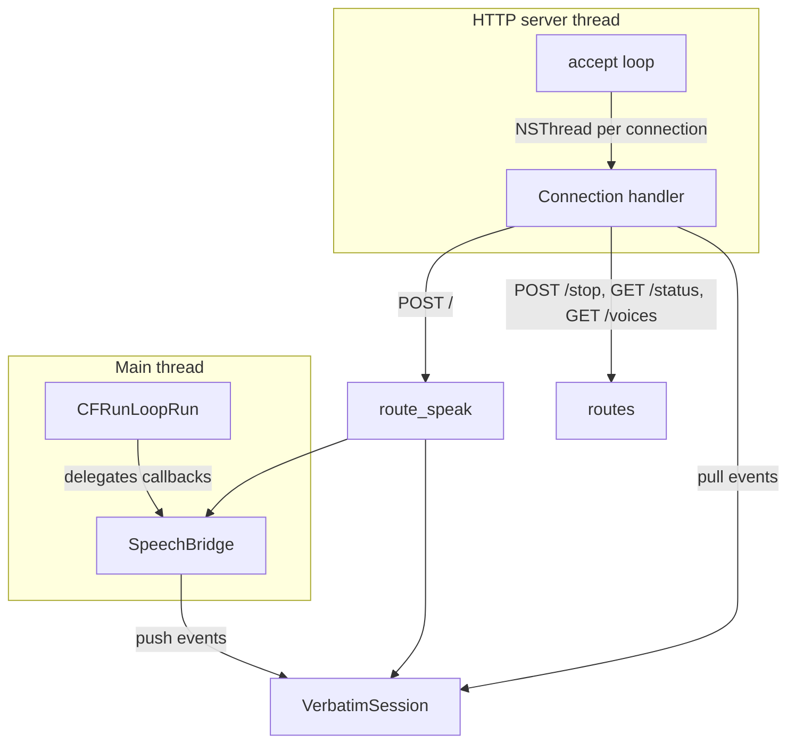

# DEV.md — Developer Guide

> For API usage, see [README.md](README.md). For complete internal architecture, see [PROJECT_BRIEF.md](PROJECT_BRIEF.md).

---

## Architecture Overview

verbatimd is a two-thread system with a simple speech engine:



**Main thread** runs `CFRunLoopRun()` forever. This is required for `NSSpeechSynthesizer` delegate callbacks (`willSpeakWord`, `didFinishSpeaking`) to fire. The main thread never does I/O or networking.

**HTTP server thread** runs `[HttpServer runWithConfig:]`, which blocks in `accept()`. Each accepted connection spawns a new NSThread block that reads the request, dispatches to a route handler, and writes the response.

**Speech engine** is a single global `NSSpeechSynthesizer` guarded by `NSLock`. One utterance at a time — new requests supersede previous. The `sender != g_synth` identity check in the delegate prevents stray callbacks from a superseded synthesizer.

**Event queue** (`VerbatimSession` + `VerbatimEventQueue`) uses `NSCondition` for push-from-delegate / blocking-pull-from-HTTP semantics. Events are NDJSON strings pushed by the speech delegate and pulled by the HTTP connection thread.

## Build System

```sh
make help         # show all targets and build options
make              # release (-O3)
make debug        # debug (ASan + UBSan, -g3)
make clean        # REQUIRED after editing any .h file (no dep tracking in Makefile)
make format       # .clang-format: tabs, 100-col, pointer-right
```

Build options (Makefile `O_` variables):

| Variable                     | Default | Effect                                    |
| ---------------------------- | ------- | ----------------------------------------- |
| `O_DEBUG`                    | `0`     | Enable debug build (ASan, UBSan, -g3)     |
| `O_LOG_SHOW_SOURCE_LOCATION` | `1`     | Prepend `[file:line:func]` to log output  |
| `O_LOG_SHOW_TIME_STAMP`      | `1`     | Prepend `[HH:MM:SS.uuuuuu]` to log output |

Compiler flags: `-Isrc -std=c17 -fobjc-arc -Wall -Wextra -Wpedantic -Wshadow -Wconversion -Wstrict-prototypes -Wmissing-prototypes`

Linker flags: `-lpthread -framework Foundation -framework AppKit`

**No dependency tracking in Makefile.** Header changes require `make clean` before rebuilding.

## Server Endpoints

### POST /

Speak text via `NSSpeechSynthesizer`.

**Request:** Raw UTF-8 text body (not JSON).

**Headers:**

| Header      | Type     | Default        | Description                                                                            |
| ----------- | -------- | -------------- | -------------------------------------------------------------------------------------- |
| `TTS-Voice` | string   | system default | Voice display name, case-insensitive. Falls back to default if not found.              |
| `TTS-Speed` | int 1–10 | `--rate` value | Maps linearly: 1→90 WPM, 5→210 WPM, 10→360 WPM                                         |
| `ndjson`    | string   | `"true"`       | `"true"`: streaming NDJSON. `"false"`: blocks until done, returns `{"status":"done"}`. |

**ndjson=true response:** `Transfer-Encoding: chunked`, content type `application/x-ndjson`. Each chunk is a newline-terminated JSON object:

```json
{"event":"started"}
{"event":"word","start":0,"length":5}
{"event":"word","start":6,"length":3}
{"event":"finished","completed":true}
```

Stream timeout: estimated speaking time × 3 + 30 seconds (minimum 60 seconds).

**ndjson=false response:** Blocks until speech finishes, returns `{"status":"done"}`.

**Errors:**

- `400` — empty or whitespace-only body
- `500` — `NSSpeechSynthesizer` creation failure, `startSpeakingString:` returned NO

**Side effects:** Interrupts any currently speaking utterance globally.

**Examples:**

```sh
# Default (streaming NDJSON)
curl -N -X POST http://127.0.0.1:5959/ -d "Hello world"

# With voice
curl -N -X POST http://127.0.0.1:5959/ \
  -H "TTS-Voice: Albert" \
  -d "Hello, I am Albert."

# With voice and speed
curl -N -X POST http://127.0.0.1:5959/ \
  -H "TTS-Voice: Samantha" \
  -H "TTS-Speed: 8" \
  -d "This is spoken very fast."

# Speed only (default voice)
curl -N -X POST http://127.0.0.1:5959/ \
  -H "TTS-Speed: 2" \
  -d "This is spoken slowly."

# Non-streaming (blocks until done)
curl -X POST http://127.0.0.1:5959/ \
  -H "ndjson: false" \
  -d "This blocks until speech finishes."

# Non-streaming with all headers
curl -X POST http://127.0.0.1:5959/ \
  -H "TTS-Voice: Albert" \
  -H "TTS-Speed: 5" \
  -H "ndjson: false" \
  -d "Blocking with custom voice and speed."

# Empty body → 400
curl -X POST http://127.0.0.1:5959/ -d ""
```

### POST /stop

Stop current speech. No request body needed.

**Response:** `{"status":"stopped"}` (always 200 OK, even if nothing was speaking).

**Side effects:** Stops the active `NSSpeechSynthesizer`. The previous session receives `{"event":"finished","completed":false}`.

**Examples:**

```sh
# Stop speaking
curl -X POST http://127.0.0.1:5959/stop
```

### GET /status

Check if the engine is currently speaking. No request body needed.

**Response:** `{"speaking": true}` or `{"speaking": false}`.

**Examples:**

```sh
# Check status
curl http://127.0.0.1:5959/status
```

### GET /voices

List available TTS voices on the system. No request body needed.

**Response:** JSON array of `{"name": "...", "language": "..."}` objects.

Voice list is cached in RAM after first call (via `dispatch_once`). The underlying `say -v '?'` process is only run once per server lifetime.

**Examples:**

```sh
# List voices
curl http://127.0.0.1:5959/voices

# Pretty-print with jq
curl -s http://127.0.0.1:5959/voices | jq .
```

### Unknown routes

Returns 404 with `{"error":"not found"}`.

**Examples:**

```sh
# Unknown route
curl http://127.0.0.1:5959/nonexistent
```

## Client Behavior

- **Connection:** Always `Connection: close` — no HTTP keep-alive.
- **Body size limit:** 1 MB (`Content-Length` > 1 MB is rejected immediately).
- **Truncated bodies:** Requests with `Content-Length` that don't match the actual body are rejected (no partial text spoken).
- **Receive timeout:** 30 seconds per client socket (prevents slowloris).
- **Concurrent request limit:** 64 simultaneous connection threads. Additional connections block until a slot opens.

## Concurrency

- **Thread-per-connection:** Each HTTP connection gets its own `NSThread`. No thread pool.
- **Event queue blocking:** `[session nextEvent]` blocks the connection thread until an event arrives or a 30-second timeout fires.
- **Lock ordering:** `g_engine_lock` (NSLock) → queue `NSCondition`. Consistent everywhere, no deadlock possible.
- **No rate limiting:** Beyond the 64-connection throttle, there is no rate limiting.

### Rapid-fire requests

There is no request queue. If a `POST /` arrives while another utterance is already speaking, the new request **immediately interrupts** the current one:

1. The active `NSSpeechSynthesizer` is stopped via `stopSpeaking`.
2. The interrupted session receives `{"event":"finished","completed":false}` as its terminal event.
3. A new synthesizer is created and the new text starts speaking.

This happens synchronously inside `[SpeechBridge speakWithSession:]` — there is no waiting, no buffering, no FIFO. The last request always wins. If you send 10 rapid-fire requests, only the 10th one will be spoken; the first 9 will each get a `completed:false` finish event.

## Repository Layout

```
verbatim/
├── src/                        # All source code (flat, no subdirectories)
│   ├── main.m                  # Entry point
│   ├── command_line.*          # CLI argument parsing (custom, no argp)
│   ├── log.*                   # Thread-safe leveled logger
│   ├── json_writer.*           # JSON serialization (NSJSONSerialization wrapper)
│   ├── http_parse.*            # HTTP request parsing (recv + parse)
│   ├── http_response.*         # HTTP response writing (plain + chunked)
│   ├── http_server.*           # Socket accept loop, per-connection handling
│   ├── voices.*                # `say -v '?'` output parsing
│   ├── route_helpers.*         # Shared route utilities (speed mapping, JSON helpers)
│   ├── route_speak.*           # POST / handler (NDJSON streaming)
│   ├── speech_bridge.*         # NSSpeechSynthesizer wrapper
│   ├── verbatim_event_queue.*  # Thread-safe event queue (NSCondition)
│   ├── routes.*                # POST /stop, GET /status, GET /voices, 404
│   └── project_config.h        # Version string, binary name, metadata
├── build/                      # Build artifacts (gitignored)
├── Makefile                    # Build system
├── .clang-format               # Code formatting rules
├── README.md                   # User-facing docs, API reference
├── DEV.md                      # This file
├── PROJECT_BRIEF.md            # Complete codebase reference
└── AGENTS.md                   # AI agent instructions
```

## Development Guidelines

### Code style

- Tabs for indentation (enforced by `.clang-format`)
- `snake_case` for constants and enums
- Opening braces on same line
- Comment above non-obvious functions explaining _why_
- Pointer alignment: right (`char *ptr`)
- Column limit: 100

### Logging

Use `LOG_*` macros (`LOG_INFO`, `LOG_ERROR`, etc.). Every HTTP request is logged at INFO level with client IP. Thread safety is via `@synchronized` on the Logger class.

### Error handling

- **POSIX errors:** Logged via `LOG_PERROR` (includes `strerror(errno)`).
- **HTTP errors:** Sent as JSON responses via `[RouteHelpers sendJSONErrorWithFD:...]`.
- **Speech errors:** Pushed as terminal events (`{"event":"error","message":"..."}`) to the session queue.

### Testing

No automated test suite. Audio path requires real macOS + speakers. Manual verification:

```sh
make && ./verbatimd --log-level debug &
curl http://127.0.0.1:5959/status
curl -N -X POST http://127.0.0.1:5959/ -d "Hello world"
curl -X POST http://127.0.0.1:5959/stop
```

### Debugging

- `make debug` enables ASan + UBSan + -g3 debug info
- Use `lldb ./verbatimd` for debugging
- `--log-level trace` shows per-word delegate callbacks and stray callback suppression

## Common Changes

| Task                       | Files to touch                                      |
| -------------------------- | --------------------------------------------------- |
| Add a CLI flag             | `command_line.h/.m`, `http_server.h` (ServerConfig) |
| Add an HTTP endpoint       | `routes.h/.m`, `http_server.m` (dispatch block)     |
| Change speech event format | `speech_bridge.m` (delegate methods)                |
| Modify event queue         | `verbatim_event_queue.h/.m`                         |
| Change HTTP parsing        | `http_parse.h/.m`, `http_response.h/.m`             |
